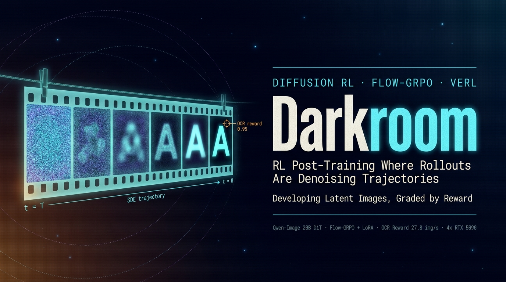

<!-- PROJECT LOGO -->
<div align="center">
  <a href="https://github.com/ChaoyuWang04/Darkroom_VeRL-Omni">
    
  </a>

<h3 align="center">Darkroom</h3>

<p align="center">
  RL post-training for diffusion models on verl — Flow-GRPO on Qwen-Image (20B DiT), where each rollout is a stochastic denoising trajectory instead of a token sequence. Evidence-based upstream reconnaissance, a drop-in local OCR reward replacing the GPU-hungry VLM judge at 27.8 img/s on CPU, and a validated single-GPU smoke path on RTX 5090.
  <br /><br />
  | <a href="https://github.com/ChaoyuWang04/AdCampaignAgent-SFT/issues/new?labels=bug&template=bug-report---.md">Report Bug</a> |
  <a href="https://github.com/ChaoyuWang04/AdCampaignAgent-SFT/issues/new?labels=enhancement&template=feature-request---.md">Request Feature</a> |
</p>

</div>

## About

In film photography, the invisible image recorded on exposed film is literally called the **latent image** — it only becomes a photograph in the darkroom, where the developer gradually pulls structure out of grain. Diffusion models do the same thing to their latents, and Darkroom studies what happens when you put that development process under reinforcement learning: the print gets graded (reward), and the chemistry gets adjusted (policy update).

Three mental models separate diffusion RL from LLM RL, and the whole project is organized around them:

1. **The rollout is a denoising trajectory in continuous latent space**, not a token sequence. Flow-GRPO's core trick is converting the deterministic ODE sampler into an SDE so that per-step Gaussian transitions have a likelihood at all
2. **One rollout is a heterogeneous pipeline** — text encoder → DiT (N compute-bound denoising steps) → VAE (one memory-bound decode) — with wildly different memory/compute profiles per stage
3. **The reward is itself a model** (OCR scorer, VLM judge, aesthetic model), competing for GPUs with training — which makes reward deployment a first-class throughput concern

Sister project to [Syncopate](https://github.com/ChaoyuWang04/Syncopate_Async_AgenticRL): that one studies RL infra under *long-tail* rollouts, this one under *heterogeneous* rollouts — together they cover the two frontier tensions of RL post-training systems.

Status: Phase-0 reconnaissance complete, reward module built and benchmarked, single-GPU smoke validated end-to-end; multi-GPU cloud training is next (see roadmap).

## Upstream Reconnaissance — Where the Code Actually Lives

All conclusions below come from cloned source at pinned commits, not from docs or second-hand posts. The headline finding:

> **verl main contains no diffusion-RL training code.** `examples/README.md` advertises `flowgrpo_trainer/`, but the directory does not exist on main — the README landed before the code. The actual Flow-GRPO implementation lives in a stack of closed-but-unmerged PRs: **#5297** (trainer + full QwenImage pipeline), #5716 (diffusion agent-loop rollout), #5713 (image-based rewards). Building "main from source" gets you nothing; you must check out the PR stack.

Model-selection verdict, by memory accounting and E2E coverage:

| Decision | Verdict |
|---|---|
| Model + algorithm | **Qwen-Image (20B DiT) + Flow-GRPO + LoRA** — the only released, E2E-complete entry point |
| Official minimum config | LoRA: **4 GPUs** · Full-FT: **8 GPUs** |
| 4×5090 (128 GB) feasibility | LoRA viable but tight — the binding constraint was the VLM reward judge occupying a full GPU |
| The unlock | The judge is just "VLM used as OCR + Levenshtein" → **replace it with local CPU OCR and reclaim the entire GPU** |

## The OCR Reward — Reclaiming the Judge GPU

`src/rewards/ocr_reward.py` re-implements the upstream `compute_score_ocr` scoring (`1 − Levenshtein(ocr, gt)/len(gt)`, verbatim-identical) on **RapidOCR with ONNX Runtime CPU** — chosen over PaddleOCR because it pip-installs cleanly on fresh environments and multi-processes well.

Benchmarked on 512 rendered-text images (512×512, EN/CN/mixed), target ≥ 4 img/s so reward never bottlenecks a training step:

| Mode | Throughput | 512 images | mean_score |
|---|---|---|---|
| CPU ×1 process | 4.32 img/s | 118.6 s | 0.953 |
| CPU ×4 pool | 13.75 img/s | 37.2 s | 0.953 |
| CPU ×8 pool | **27.8 img/s** | 18.4 s | 0.953 |

**6.9× headroom over target, zero GPUs consumed** — the reward moved off the accelerator budget entirely.

## Single-GPU Smoke — The First Developed Print

bf16 Qwen-Image cannot fit a 5090 (40.9 GB transformer + 16.6 GB text encoder vs 32 GB VRAM / 30 GB RAM), and online FP8 OOMs on the load transient. The working recipe is **GGUF Int4** (Q4_K_M transformer ≈ 13 GB), validated on sm_120:

- 512×512, 10 steps: **1.40 s of diffusion (140 ms/step)**, peak VRAM 30.3/32.6 GB, exit 0
- Prompt asks for the word "HELLO" → generated image → local OCR reward: **score = 1.000, recognized = 'HELLO'** — the full generate-then-grade loop closes end-to-end on one consumer GPU

<div align="center">
  
  <br /><em>The first developed print — graded 1.000 by the local OCR reward.</em>
</div>

- Non-obvious trap documented: `--enable-cpu-offload` *breaks* this setup — the GGUF transformer pinned in RAM collides with the bf16 text encoder transiting RAM, and the OOM-killer silently SIGKILLs the worker
- Also verified: the two community GGUF sources (city96 / QuantStack) are byte-identical in quant layout, checked per-tensor from file headers

Environment is fully locked and reproduced (`docs/env_lock.md`): torch 2.11.0+cu130 with `get_device_capability() == (12, 0)` verified, plus a pitfall log (`docs/setup_pitfalls.md`) covering the mainland-China mirror/proxy discipline — domestic mirrors go direct, foreign sources go through the proxy, never mix.

## Repository Layout

```text
Darkroom/
├── src/rewards/              # local OCR reward, upstream-identical scoring (RapidOCR, CPU)
├── tests/                    # reward correctness + throughput benchmark, text renderer
├── scripts/                  # GGUF smoke driver (GPU-polite: waits, never kills other jobs)
├── data/                     # smoke outputs (the first developed print lives here)
├── docs/
│   ├── plan_1_verl_omni.md   # full project plan: phases, memory budgets, risk table
│   ├── model_decision.md     # evidence-based model verdict + PR-stack archaeology
│   ├── reward_benchmark.md   # OCR reward throughput study
│   ├── qwen_image_smoke.md   # GGUF Int4 smoke recipe + cpu-offload trap
│   ├── env_lock.md           # reproduced environment lock (sm_120)
│   └── setup_pitfalls.md     # symptom → root cause → fix → lesson, per pitfall
└── models/                   # local weights (gitignored)
```

## Requirements

- Python 3.12 · conda + `uv`
- RTX 5090-class GPU (sm_120) with a cu130-matched PyTorch (2.11.0+cu130 locked in `docs/env_lock.md`)
- `rapidocr-onnxruntime` + `python-Levenshtein` for the reward module (CPU only)
- vllm-omni + verl PR-#5297 stack for the training path (see `docs/model_decision.md`)

## Usage

```sh
# OCR reward: correctness against upstream scoring + throughput benchmark
pytest tests/test_ocr_reward.py
python tests/bench_ocr_throughput.py

# Single-GPU Qwen-Image GGUF smoke (downloads GGUF, waits for a free GPU, then
# generates a text-rendering image and grades it with the local OCR reward)
bash scripts/run_qwen_image_gguf_smoke.sh
```

## Roadmap

- [x] Upstream reconnaissance at pinned commits: Flow-GRPO lives in the PR-#5297 stack, not main
- [x] Model verdict: Qwen-Image + Flow-GRPO + LoRA, official minimums confirmed (4 GPU LoRA / 8 GPU full)
- [x] Local OCR reward, upstream-identical scoring, 27.8 img/s on CPU — judge GPU reclaimed
- [x] Single-GPU GGUF Int4 smoke on sm_120, generate-then-grade loop closed (score = 1.000)
- [x] Environment lock + pitfall log (proxy/mirror discipline, cpu-offload trap)
- [ ] PR-#5297 stack checkout + dry-run of the data → rollout → reward → update path
- [ ] Cloud 4×5090 Phase 1: Flow-GRPO + LoRA + OCR reward, first rising reward curve
- [ ] Phase 2: 500+ step training, nsys time breakdown (rollout / reward / update / sync), async-reward on/off A/B
- [ ] Reward-hacking study: how diffusion models cheat an OCR judge (expect image distortion with high OCR score)
- [ ] Architecture deep-read: VeRL-Omni's intrusion points into verl's HybridFlow abstraction
- [ ] Upstream issue/PR from pre-release potholes; stretch: Qwen-Omni (AR-DiT hybrid) RL path

## Contributing

Issues and pull requests are welcome. The highest-leverage areas:
- alternative lightweight rewards (aesthetic scorers, layout checkers) that stay off the GPU budget
- memory recipes for Qwen-Image-class models on consumer GPUs
- diffusion reward-hacking examples and countermeasures

## Links

- Project: [https://github.com/ChaoyuWang04/Darkroom_VeRL-Omni](https://github.com/ChaoyuWang04/Darkroom_VeRL-Omni)
- Author: [Chaoyu Wang](https://www.linkedin.com/in/samwang04/)

## License

Distributed under the MIT License. See `LICENSE` for more information.
