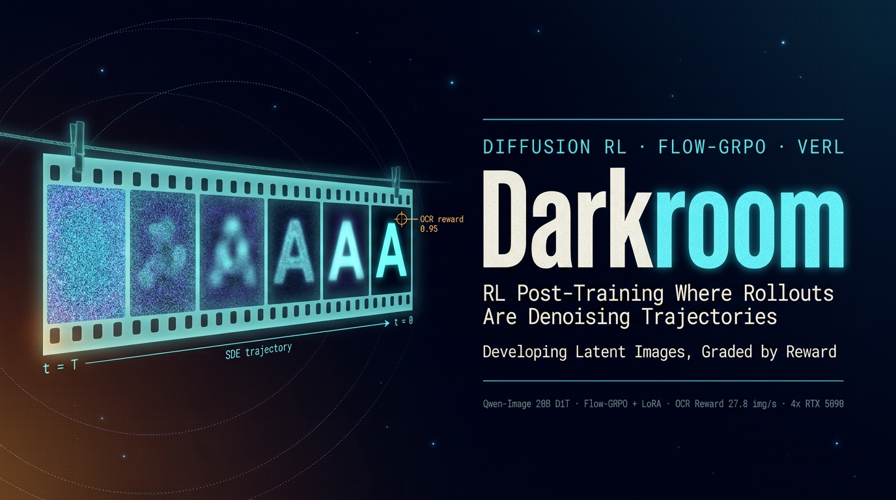

<!-- PROJECT LOGO -->
<div align="center">
  <a href="https://github.com/ChaoyuWang04/Darkroom_VeRL-Omni">
    
  </a>

<h3 align="center">Darkroom</h3>

<p align="center">
  Turning a subjective generative task into a verifiable one. Darkroom is an SFT + RL post-training system for <b>ad creative generation</b> — where "is this image good?" is replaced by a machine-checkable question: <b>can this image actually be shipped?</b>
  <br /><br />
  | <a href="https://github.com/ChaoyuWang04/Darkroom_VeRL-Omni/issues/new?labels=bug">Report Bug</a> |
  <a href="https://github.com/ChaoyuWang04/Darkroom_VeRL-Omni/issues/new?labels=enhancement">Request Feature</a> |
</p>

</div>

## About

In film photography, the invisible image on exposed film is literally called the **latent image** — it only becomes a photograph in the darkroom, where the developer pulls structure out of grain. Diffusion models do the same to their latents. Darkroom studies what happens when you put that development process under reinforcement learning: the print gets graded, and the chemistry gets adjusted.

But grading is the whole problem. **Most image post-training projects stop at style transfer, because style has no verifier** — you can only eyeball it. Darkroom's premise is that this is a choice, not a limit:

> The axis that matters is not *generation vs. something else*. It is **unverifiable aesthetics vs. verifiable constraint satisfaction**.

Pick a capability that a program can grade, and image post-training becomes exactly as deep as any RLVR problem — arguably deeper, because the grader is a stack of detectors rather than a schema check.

## The Task: Ad Creative Generation

Given a product, a promo copy, a placement spec, and a brand guideline, produce an image that can be **shipped without a designer touching it**.

That single question decomposes into four machine-checkable ones:

$$\text{deliverable} = \underbrace{\text{OCR exact match}}_{\text{copy}} \wedge \underbrace{\text{elements present}}_{\text{detector}} \wedge \underbrace{\text{layout legal}}_{\text{geometry}} \wedge \underbrace{\text{compliant}}_{\text{gate}}$$

Every term is a program. None of them is a human opinion. Aesthetics still gets measured — but at weight 0.05, as a **monitor against collapse**, never as the steering wheel, because aesthetic reward models are exactly what reward hacking eats first.

## Why This Shape

One image must satisfy many constraints **at once**, and the constraints pull against each other — longer copy is harder to render legibly; more required elements crowd the composition; a locked brand color shrinks the usable palette. That tension is where the gradient lives.

This makes Darkroom the structural dual of its sister project [Syncopate](https://github.com/ChaoyuWang04/Syncopate_Async_AgenticRL), which studies agentic RL under long-tail tool-calling rollouts:

|  | Syncopate | Darkroom |
|---|---|---|
| rollout | multi-step tool chain | **single-step** denoising trajectory |
| process reward | yes | **none** — intermediate denoising steps aren't judgeable |
| complexity from | **many steps** × per-step correctness | **one step** × **many simultaneous constraints** |
| runtime | gateway, tools, approval | none — its "runtime" is **reward serving** |

$$\textbf{multi-step} \times \textbf{single-constraint}\quad\longleftrightarrow\quad\textbf{single-step} \times \textbf{multi-constraint}$$

Together they cover the two frontier tensions of RL post-training systems. In business terms they also compose: Syncopate decides *what to run and how much to spend*; Darkroom decides *what the creative looks like*.

## Design Principles

Three lines get drawn before any code:

| What | Where it goes | Why |
|---|---|---|
| Subjective (is it pretty?) | **SFT data distribution** | Put it in the reward and you get the high-saturation, plastic "reward face" |
| Objective (does it ship?) | **RL reward** | Program-checkable — the legitimate RLVR target |
| Non-negotiable (compliance) | **Code gate** | A compliance incident can't depend on the model behaving |

Two consequences worth stating up front:

- **The sandbox can verify *shippability*, never *performance*.** Whether a creative earns its CTR is a signal that only exists after it runs. The ceiling here is "an executor that never needs rework," not "a creative director." That's an honest ceiling, and shippability is independently worth money — rework costs a designer half a day.
- **Image SFT shifts a distribution; it does not teach an answer.** The flow-matching loss never changes from pretraining through SFT — only the data does. So SFT cannot teach a *judgment* like "this copy won't fit." That decision lives in a rule layer in front of the model, not in the weights.

## Status

**Design complete. Execution starts at the verifier.**

This repository currently contains the design, not an implementation. The ordering is deliberate — the verifier *is* the reward, so a wrong verifier corrupts every training signal downstream:

> **Define the goal → build the ruler → measure the ruler → make the data → train.**

The base model is deliberately **not yet fixed**. It will be chosen by measurement in S2, on one criterion: which backbone leaves the most trainable headroom on our task grid. The strongest model at a task is not the best model to *train* on that task — a saturated cell has no gradient.

## Roadmap

| Stage | Content | Gate |
|---|---|---|
| **S1** | Verifier suite: compliance gate · OCR + gibberish · element/geometry · brand | ★ Verifier's own precision/recall must pass before anything trains |
| **S2** | Base audit across candidate backbones — saturated / dead / trainable cells | Full grid coverage, frozen eval split, zero leakage |
| **S3** | Data pipeline: programmatic rendering + VLM recaption, with an A/B proving recaption's effect | Rendered images must pass their own verifier |
| **S4** | SFT — KPI is "can RL train on this," not "is the score high" | Dead-cell unlock, layout diversity, no catastrophic forgetting |
| **S5** | Flow-GRPO on multi-constraint reward | Zero compliance hits, gradient alive, layout entropy intact |
| **S6** | Evaluation report, write-up, upstream contributions | Every placeholder replaced by a measured number |

Full task list with 58 scriptable acceptance criteria: [`docs/darkroom-task-checklist-v0.1.md`](docs/darkroom-task-checklist-v0.1.md)

## Repository Layout

```text
Darkroom/
├── docs/
│   ├── darkroom-project-design-v0.1.md           # ★ scenario, verifier, reward, negative data
│   ├── darkroom-task-checklist-v0.1.md           # ★ ordered tasks + quantified gates
│   └── multimodal-gen-training-survey-2026-08.md # cross-modality training handbook
├── images/                                        # branding
├── models/                                        # local weights (gitignored)
└── reference/                                     # external study material (gitignored)
```

## Contributing

Issues and pull requests are welcome. The highest-leverage areas:

- lightweight, program-checkable rewards for generative tasks that stay off the GPU budget
- detectors that stay accurate on **synthetic** imagery (most are trained on natural photos)
- reward-hacking fingerprints for diffusion RL — the visual failure modes differ sharply from text

## Links

- Project: [https://github.com/ChaoyuWang04/Darkroom_VeRL-Omni](https://github.com/ChaoyuWang04/Darkroom_VeRL-Omni)
- Sister project: [Syncopate](https://github.com/ChaoyuWang04/Syncopate_Async_AgenticRL)
- Author: [Chaoyu Wang](https://www.linkedin.com/in/samwang04/)

## License

Distributed under the MIT License. See `LICENSE` for more information.
